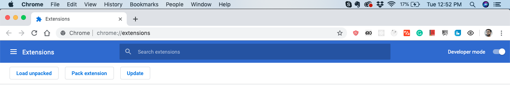

<h1 align="center">
  <br>
  <a href="https://chrome.google.com/webstore/detail/eye-blinker/fbgchecgijgcacfckobealojikbohcdd"></a>

</h1>

<h4 align="center">Eye Blinker is a Google Chrome extension that will help for the computer users to follow the 20-20-20 rule</h4>

<div align="center">
  Built with ❤︎  
</div>

## Technologies

- [React](https://reactjs.org/) - JavaScript library for building user interfaces.
- [Semantic-ui-react](https://react.semantic-ui.com/)-Semantic-UI-React integration.

## Getting Started

#### Clone the project

```sh
# clone it
git clone git@github.com:muhzi4u/eyeblinker-app.git
cd eyeblinker-app
# Make it your own
rm -rf .git && git init
```

#### Run the project

```
# Install dependencies
yarn install
# Start the app
yarn run start

```

#### Run chrome extension

```
# Make a build
yarn build
```

```
# Open chrome://extensions/ from your chrome browser and enable Developer mode
```



```
# Click on "Load unpacked" button and upload the build folder
```

## ☑ TODO

- [ ] Ability to add sounds for reminder
- [ ] Ability to customize reminder message
- [ ] Change the font family
- [ ] Add google analytics

Find me on [twitter](https://twitter.com/muhsinkeramam) if you have any questions or comments!

## License

MIT
